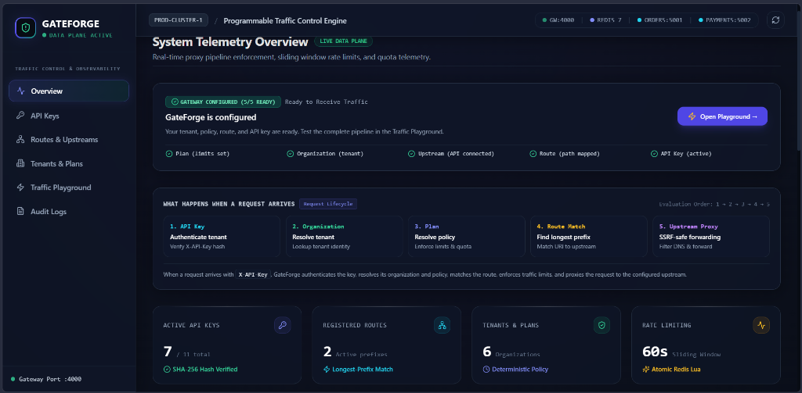
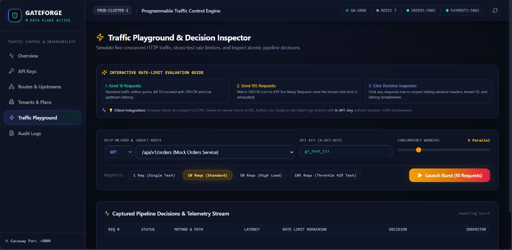
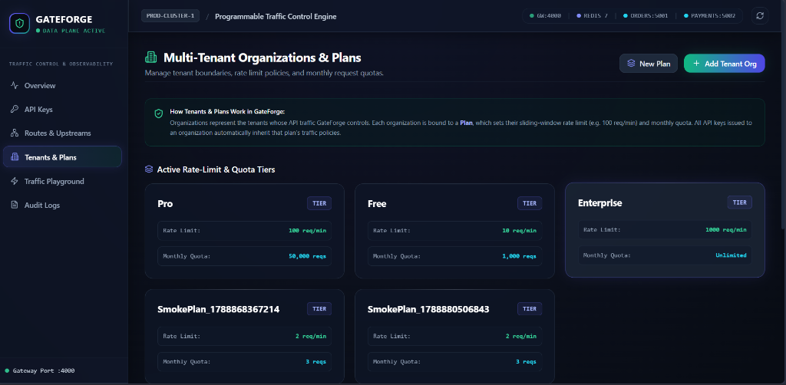
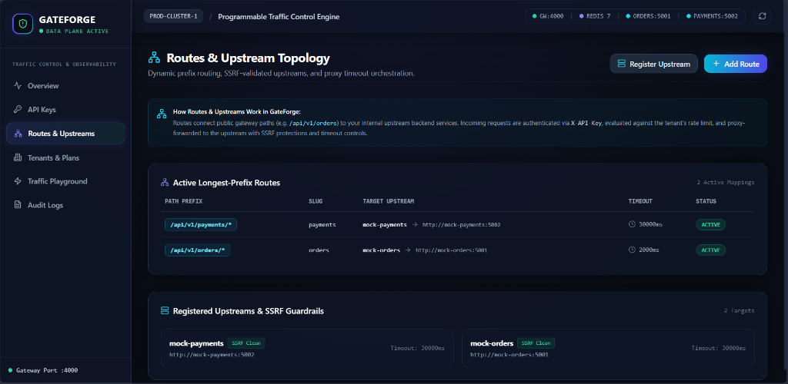
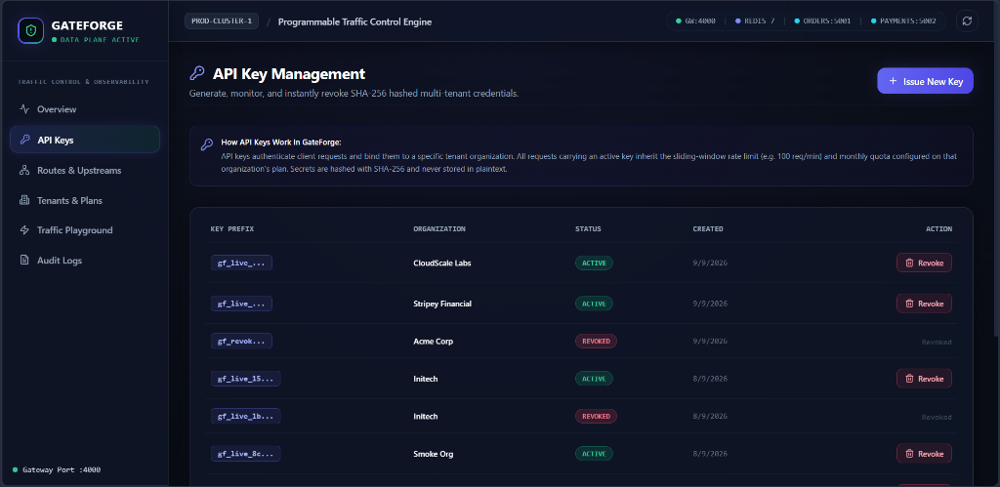

# 🔒 GateForge

> **Programmable Multi-Tenant API Traffic Control System**  
> High-performance API Gateway Data Plane, Isolated Control Plane, Real-Time Observability Inspector & Interactive Traffic Playground.

[](https://github.com/ManasBhardwaj07/GateForge/actions)
[](https://github.com/ManasBhardwaj07/GateForge)
[](https://www.typescriptlang.org/)
[](LICENSE)

---

## 1. Executive Summary & Engineering Rationale

GateForge is a portfolio-scale programmable API traffic-control platform and gateway engineered from first principles. It demonstrates the exact class of distributed systems problems solved by modern API infrastructure (e.g. Kong, Cloudflare, AWS API Gateway): multi-tenant credential hashing, atomic rate-limiting, monthly quota enforcement, SSRF guardrails, dynamic longest-prefix proxy dispatch, and transactional telemetry accounting.

### 🎯 Why This Is a Serious Engineering Project

Most "API Gateway" demos are thin wrappers around an off-the-shelf reverse proxy. GateForge is engineered from the protocol layer up to address real production challenges:

1. **Zero Database Writes on the Hot Path**: High-throughput reverse proxies cannot afford synchronous SQL writes per request. GateForge resolves authenticated API keys and policy limits from Redis in $<1.2\text{ ms}$, while recording request counts into an in-memory lock-free time-bucket aggregator that flushes transactionally to PostgreSQL in asynchronous 5-minute batches.
2. **Atomic Sliding Window Rate Limiting**: Token-bucket algorithms often permit burst clustering at boundary windows. GateForge executes custom **Redis Lua scripts** (`sliding_window.lua`) that atomically prune expired timestamp entries, count active requests in the current 60-second window, and increment usage in a single atomic roundtrip—guaranteeing zero race conditions under high concurrency.
3. **Defense-in-Depth SSRF Protection**: Naive gateways allow attackers to proxy into internal infrastructure (`http://169.254.169.254`, `http://localhost:5432`, `http://10.0.0.1`). GateForge enforces two-phase validation:
   - **Save-Time Resolution**: Hostnames are resolved through DNS and verified against RFC 1918, RFC 3927 link-local, loopback, and cloud metadata ranges using `ipaddr.js`.
   - **Connection-Time Pinning**: Proxy agent sockets validate the destination IP address prior to dispatch, preventing Time-of-Check to Time-of-Use (TOCTOU) DNS rebinding exploits.
4. **Instant Cache-Invalidated Key Revocation**: When an administrator revokes an API key via the Control Plane, an atomic `DEL key_auth:<hash>` invalidates the Redis cache immediately, cutting off compromised credentials within sub-milliseconds across the entire cluster.
5. **Physical Data Plane & Control Plane Separation**: Administrative mutations run on a dedicated internal port (`:4001`) protected by constant-time bearer tokens and strict IP rate limiting, completely isolated from public client traffic hitting port `:4000`.

---

## 2. System Architecture & Request Lifecycle

```
                      ADMINISTRATOR / CONTROL PLANE (:4001) / DASHBOARD (:3000)
                                                 │
                   1. Define Plan:       Pro Tier (100 req/min, 50,000 req/month)
                   2. Create Tenant:     Acme Corp (assigned to Pro Plan)
                   3. Connect Upstream:  Orders Service (http://mock-orders:5001)
                   4. Map Route:         /api/v1/orders/*  → Orders Upstream
                   5. Issue API Key:     gf_live_... (SHA-256 stored; secret revealed once)
                                                 │
                                                 ▼
CLIENT (or Playground) ──►  GATEFORGE DATA PLANE (:4000)  ──►  UPSTREAM MICROSERVICES
  GET /api/v1/orders/123       1. Auth (SHA-256 Hash + Redis)     GET /orders/123 (:5001)
  X-API-Key: gf_live_...       2. Resolve Tenant Identity         Returns: 200 OK
                               3. Resolve Rate & Quota Policy     [{"id":1,"item":"golf ball"}]
                               4. Atomic Sliding Window (Lua)
                               5. Longest-Prefix Route Match
                               6. SSRF Filter & Timeout Control
                               7. Dynamic Reverse Proxy
                               8. Memory-Aggregated Telemetry
```

### 🔍 What Happens When a Request Arrives

Every incoming HTTP request traverses a deterministic 5-step evaluation sequence:

1. **API Key Authentication**: Hashes the incoming `X-API-Key` using SHA-256, looks up the key in Redis (or falls back to PostgreSQL on cold cache), and rejects inactive or revoked keys with `401 Unauthorized` or `403 Forbidden`.
2. **Organization Resolution**: Resolves tenant status and ensures the parent organization is active.
3. **Plan Policy Enforcement**: Evaluates the organization's tier limits. An atomic Redis Lua script increments the 60-second sliding window and calendar month counter. If breached, GateForge terminates the pipeline with HTTP `429 Too Many Requests`.
4. **Route Match**: Evaluates the request URI against active routing tables using **longest-prefix matching** to select the most specific upstream target.
5. **Upstream Proxy**: Pins the resolved upstream IP address against SSRF rules, sets an upstream timeout deadline (e.g. 2000ms), forwards client headers with an injected `X-Request-Id` (UUID v4), and pipes the upstream response back to the client.

---

## 3. Platform Visual Tour

### 📊 System Telemetry Overview
Real-time operational dashboard with live cluster health monitoring, 5/5 setup verification, and request evaluation lifecycle visualization.



---

### ⚡ Traffic Playground & Decision Inspector
Interactive traffic simulator allowing operators to test concurrent load bursts, observe real-time `429 Too Many Requests` throttling, and slide open the **Decision Inspector** to examine request headers, tenant resolution, and upstream roundtrip latency.



---

### 🏢 Multi-Tenant Organizations & Plans
Configure deterministic rate-limiting tiers (per-minute sliding window) and monthly quota boundaries across multiple isolated tenant organizations.



---

### 🌐 Dynamic Routes & Upstream Topology
Longest-prefix path routing with configurable per-route timeouts and real-time SSRF private IP validation.



---

### 🔑 API Key Management & Lifecycle
Generate multi-tenant SHA-256 hashed credentials with one-time reveal modals, prefix indexing, and instantaneous revocation with cache invalidation.



---

## 4. Technology Stack & Monorepo Architecture

GateForge is structured as an npm workspaces monorepo with clean separation between shared models and running applications:

```
GateForge/
├── apps/
│   ├── gateway/                  ← High-Performance Data Plane (:4000) & Control API (:4001)
│   │   └── src/
│   │       ├── lib/              ← Pooled DB, Redis singleton, SSRF guard, usage aggregator
│   │       ├── lua/              ← Atomic Redis Lua rate-limit scripts
│   │       ├── middleware/       ← Auth, Route Matcher, Policy, Rate & Quota enforcers
│   │       ├── proxy/            ← Dynamic Upstream Reverse Proxy
│   │       └── controlPlane.ts   ← Operator CRUD API & cache eviction
│   │
│   ├── dashboard/                ← Next.js 14 App Router UI & Decision Inspector (:3000)
│   │   ├── app/                  ← Overview, API Keys, Routes, Tenants, Playground, Audit
│   │   └── components/           ← Decision Inspector Drawer, Modal dialogs, Status pills
│   │
│   ├── mock-orders/              ← Upstream Microservice A (:5001)
│   │   └── src/server.ts         ← /orders, /slow (5s delay), /error (500 throw), /health
│   │
│   └── mock-payments/            ← Upstream Microservice B (:5002)
│       └── src/server.ts         ← /payments/:id, POST /payments, /health
│
├── packages/
│   └── db/                       ← Shared Prisma schema, migrations & seed scripts
│       └── prisma/
│           ├── schema.prisma     ← Organization, Plan, ApiKey, Route, Upstream, UsageHourly, AuditEvent
│           └── seed.ts           ← Multi-tenant production seeding script
│
├── docs/
│   └── screenshots/              ← Dashboard & Architecture screenshots
├── docker-compose.yml            ← 6-container production-grade local orchestration
├── vitest.config.mts             ← Vitest configuration
└── package.json
```

### Core Technologies

| Layer | Component | Version | Role |
| :--- | :--- | :--- | :--- |
| **Data Plane** | Express / Node.js | v5.x / Node 24 LTS | High-throughput HTTP proxy pipeline |
| **Proxy Engine** | `http-proxy-middleware` | v4.2.x | Dynamic upstream stream forwarding & timeout control |
| **Cache & Lua** | Redis 7 / `ioredis` | v7 Alpine / v5.10 | Atomic sliding-window rate limiting & instant revocation |
| **Relational DB** | PostgreSQL 16 / Prisma | v16 Alpine / v7.6 | Multi-tenant schema, relations & hourly usage rollups |
| **SSRF Defense** | `ipaddr.js` + Node DNS | v2.2.x | Two-phase private, loopback & cloud metadata filtering |
| **Web Dashboard**| Next.js 14 / Tailwind | App Router / React 18 | Glassmorphism dashboard & Decision Inspector |
| **Containerization**| Docker Compose v2 | Official Alpine | 6-service local containerized deployment |

---

## 5. Failure Modes & Status Code Semantics

Every error condition in GateForge produces predictable HTTP semantics and structured JSON payloads:

| Scenario | Condition | Gateway Status | Emitted Response & Headers |
| :--- | :--- | :--- | :--- |
| **Normal Request** | Valid active key, within rate limit & quota | `200 OK` | Proxied JSON payload + `X-RateLimit-*` & `X-Quota-*` |
| **Missing Key** | Request lacks `X-API-Key` header | `401 Unauthorized` | `{"error": "Missing API key"}` |
| **Invalid Key** | SHA-256 hash not found in cache or DB | `401 Unauthorized` | `{"error": "Invalid API key"}` |
| **Revoked Key** | Key status is `REVOKED` or expired | `403 Forbidden` | `{"error": "API key revoked or expired"}` |
| **Unmatched Route** | URI does not match any registered route prefix | `404 Not Found` | `{"error": "no matching route"}` |
| **Rate Exceeded** | Requests exceed per-minute sliding window | `429 Too Many Requests`| `{"error": "rate limit exceeded"}` (`X-RateLimit-Remaining: 0`) |
| **Quota Hit** | Total monthly tenant requests exceed quota | `429 Too Many Requests`| `{"error": "monthly quota exceeded"}` |
| **Upstream Delay** | Upstream exceeds route `timeoutMs` | `504 Gateway Timeout` | `{"error": "gateway timeout"}` |
| **Upstream 5xx** | Upstream service returns internal server error | `500 Internal Error` | Pass-through upstream error payload |
| **SSRF Rejection** | Route target attempts to resolve private IP | `400 Bad Request` | `{"error": "invalid upstream target"}` |

---

## 6. Quickstart & Local Setup

### Prerequisites
- **Node.js 24 LTS** (or `nvm use`)
- **Docker Desktop** (with Docker Compose v2)

### 1. Clone & Install Dependencies
```bash
git clone https://github.com/ManasBhardwaj07/GateForge.git
cd GateForge
npm install
```

### 2. Configure Environment
```bash
cp .env.example .env
```

### 3. Launch Full Container Stack
```bash
docker compose up --build -d
```
This initializes all 6 services:
* `gateforge-postgres-1` (`:5433` on host, `:5432` internal)
* `gateforge-redis-1` (`:6379`)
* `gateforge-db-setup-1` (Auto-runs Prisma schema push & multi-tenant seed)
* `gateforge-mock-orders-1` (`:5001`)
* `gateforge-mock-payments-1` (`:5002`)
* `gateforge-gateway-1` (Data Plane on `:4000`, Control Plane on `:4001`)
* `gateforge-dashboard-1` (Next.js Dashboard on `:3000`)

---

## 7. Manual Testing & Verification

### Test via Terminal (Direct Gateway Data Plane)

#### 1. Happy Path Proxying
```bash
curl.exe -i -H "X-API-Key: gf_test_123" http://localhost:4000/api/v1/orders
```
*Returns `HTTP/1.1 200 OK` with JSON `[{"id":1,"item":"golf ball"}, ...]` and headers `X-Request-Id`, `X-RateLimit-Remaining: 99`, `X-Quota-Used: 10`.*

#### 2. Multi-Service Longest-Prefix Routing
```bash
curl.exe -i -H "X-API-Key: gf_test_123" http://localhost:4000/api/v1/payments/42
```
*Returns `HTTP/1.1 200 OK` with `{"id":"42","status":"paid"}` from the independent mock-payments microservice.*

#### 3. Authentication Rejection
```bash
curl.exe -i -H "X-API-Key: unauthorized_key_abc" http://localhost:4000/api/v1/orders
```
*Returns `HTTP/1.1 401 Unauthorized` with `{"error": "Invalid API key"}`.*

#### 4. Route Not Found
```bash
curl.exe -i -H "X-API-Key: gf_test_123" http://localhost:4000/api/v1/nonexistent
```
*Returns `HTTP/1.1 404 Not Found` with `{"error": "no matching route"}`.*

---

## 8. Automated Test Suite

GateForge includes a comprehensive Vitest test suite verifying unit correctness, concurrent burst throughput, SSRF filter evasion, failure resilience, and control plane CRUD:

```bash
# Run all automated tests
npm test

# Run TypeScript compilation checks across all workspaces
npm run typecheck

# Run production Next.js build validation
npm run build
```

**Test Results**: **107 passing tests** across 11 test suites covering:
- Unit correctness for all 5 gateway pipeline middlewares
- Real multi-worker concurrent rate-limiting verification (sliding-window 429 transitions)
- Two-phase SSRF validation against IPv4/IPv6 private blocks, decimal-encoded IPs, and DNS rebinding
- Upstream error handling (504 gateway timeout, 500 error propagation)
- Control Plane token authorization, IP throttling, and audit event recording

---

## 9. License

GateForge is released under the **MIT License**.
